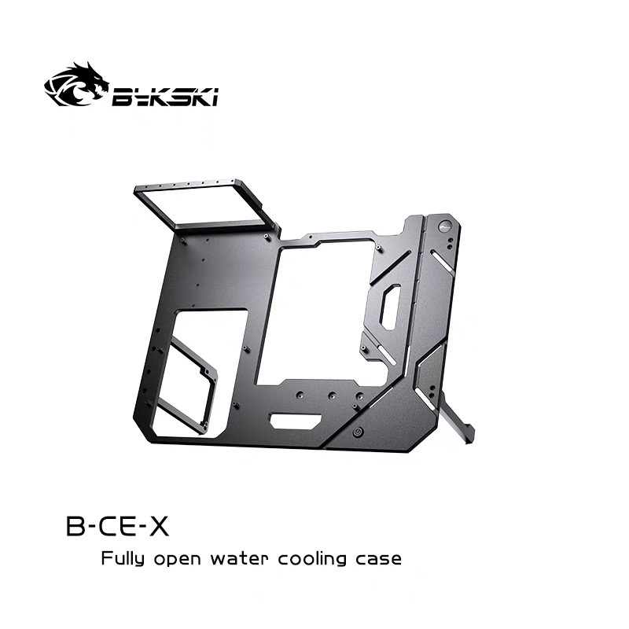

# 开放式机箱设计方案

由于市面上的机箱设计方案便宜的普遍不好看，好看又优秀的设计又导致机箱特别贵。正好我也在计划着装一台自己的电脑，所以就想能不能自己设计一套符合自己审美，又能拿出来看的机箱

在最开始我曾非常坚定的想要做壁挂主机，把所有的电脑配件都挂到洞洞板上立起来，也可以钉到墙上。后来在看了很多视频后，决定做成桌面的开放式机箱。壁挂机箱的最大缺点就是，硕大的电源也需要挂上去，成为整个壁挂主机最不和谐的地方

所以我就想，能不能把这个方块的电源藏起来，甚至让它作为机箱的一部分起到某种作用呢？

上图是我在浏览购物平台时发现的一套分体水的开放式机箱，店家也是专做水冷的，名字叫 bykski。感兴趣可以去搜索一下这个机箱 B-CE-X 的效果，这也是我这次设计的模仿

这套机箱为了能实现分体水冷和显卡的支撑，将 atx 主板旋转了 90 度摆放。作为一台开放式主机，风冷散热器可能并不合适直接放置在外面，所以尽管没有能力做分体水，我也选择了一体水作为我的开放式机箱的散热支持

在第一次的构想里，我把水冷放在了机箱背板的顶部。整个结构想要通过背板和电源以及支架来倾斜放置，然后将水冷放在较为中心的位置以平衡整个机箱结构的重心。由于我目前手边并没有台式机，只能依靠之前触碰的印象进行猜测。电源应该是在不考虑显卡的情况下电脑配件里最笨重的一个了，将它倾斜作为支点，同时分担平衡主板的重量，感觉还是挺合理的

另外有一点，我特意将主板正放，不同于 B-CE-X，以便我可以在没有前置 IO 的情况下能方便的使用主板的 IO 接口

于是我就开始用 Sharp3D 着手进行设计，并参考了网上的 m-atx 主板的尺寸以及螺丝孔位，为主板和CPU供电预留了两个应该够大的走线孔。右下角的圆形开孔是我从淘宝找到的主板开机键跳线和按钮，商家提供了 12/16/22mm 等直径的开机按键，我在这里只是以最小的 12mm 直径为例

通过简单的组合可以预估到装机后的情况，由于第一版设计需要分开部件单独制作并组装，在水冷架上就发现一开始的构想存在问题

m-atx 主板的大小是 244x244mm，这也意味着在不太突出水冷的情况下，不能选择 360 大小的水冷，最大可能就只能通过延长机箱背板让它支持 240 规格的水冷。在询问了利民 240 冰封幻境的规格后我才发现，水冷排的尺寸并非简单的两把 120 风扇拼接，而是 277x120x27，也就意味着我的背板需要至少 280 的长度才可以，并且再加上 25mm 高的风扇，整个水冷的厚度已经到了 52mm，放在机箱里可能没有什么感觉，但是在我的这种结构里，如此厚重的水冷无疑是灾难

> 这块机箱背板我找了一家铝板定制，报价为 85r，如果加厚到 5mm，预估会在 100r 出头

所以在第二版的设计里，我将水冷转移到了背板的侧面，让它改为立式的放置方式，同时由于 52mm 的厚度，我觉得不应该将整个背板再继续延长来支撑它，而是将散热器架到水冷架的外侧进行固定

我也在背板的底部添加了两个小的开孔，想让主板下面的例如开机跳线、sata线等穿过这个孔洞来进行整理。整个机箱的装饰风格也从第一版的模仿 B-CE-X 改为这种房子🏠形状的开孔和凹槽

不过我在给朋友看这套设计的时候，他提到如果我用的是铝材料做机箱，它在强度和刚性上可能会不足，所以我就在第三版里将水冷架延伸到桌面进行支撑，并且加厚了背部的电源支架和机箱脚

不过很可惜，这个开放式机箱的项目流产了（PS 最近流产的项目有点多，感觉自己很浮躁），因为我找到的商家无法直接 cnc 这么大的三维结构，而改用其他材料又会出现很多限制，而我又急于得到一个可以使用的机箱

我的模型文件 ver.1 对应 `case1.step`，ver.3 对应 `case2.step`

希望能等到一个有缘人，看到我的这个不是很成熟的开放式机箱设计方案，记得和我说一声给我看看装机的图片让我也开心一下
